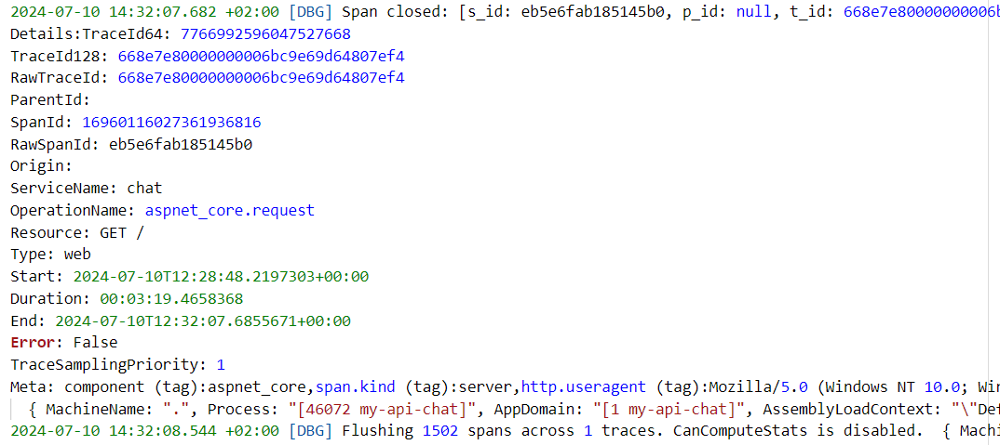
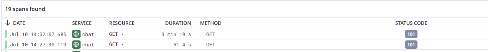
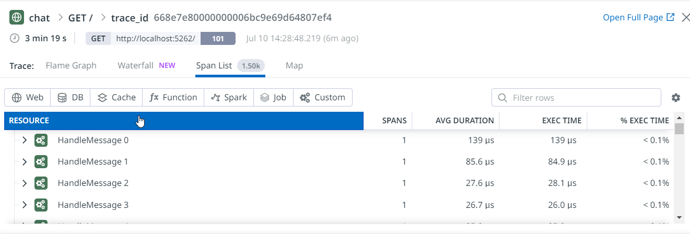
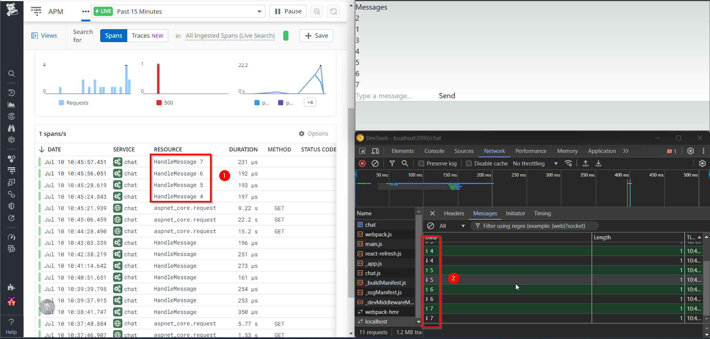

# dotnet-nextjs-otel-poc

## Setup POC
 - create an env file in the root

```plain
DD_API_KEY=YOUR_API_KEY
DD_SITE=datadoghq.eu
DD_APM_DD_URL=https://trace.agent.datadoghq.eu
```

 - Run the Datadog agent using Docker Compose at the root of the project.

```bash
docker compose up -d
```
 - create an env.local file in the nextjs app root

```plain
NODE_OPTIONS=-r ./node_modules/dd-trace/init
DD_APPLICATION_ID=YOUR_DD_APPLICATION_ID
DD_CLIENT_TOKEN=YOUR_DD_CLIENT_TOKEN
DD_SITE=YOUR_DD_SITE
```
 - Install dependencies (only the first time) and run the Next.js app.

```bash
cd my-next-app
pnpm i
pnpm run dev
```

 - Run the .NET application.

```bash
cd my-api
dotnet run
```

 - Navigate to the Next.js app at http://localhost:2999/.
 - Check Datadog for traces.

### How it works

#### Nextjs

Basic integration with Datadog can be achieved using the `dd-trace` npm package.

```bash
pnpm i --save dd-trace
```

The module is run using the NODE_OPTIONS environment variable in the .env.local file.

```plain
NODE_OPTIONS=-r ./node_modules/dd-trace/init
```

#### Dotnet

 - If you have a Datadog agent running on your host, it is sufficient to set up launchProfile.json:

```json
{
  "$schema": "http://json.schemastore.org/launchsettings.json",
  "profiles": {
    "http": {
      "commandName": "Project",
      "dotnetRunMessages": true,
      "launchBrowser": true,
      "launchUrl": "swagger",
      "applicationUrl": "http://localhost:5131",
      "environmentVariables": {
        "ASPNETCORE_ENVIRONMENT": "Development",
        "DD_TRACE_AGENT_URL": "http://localhost:8126",
        "DD_ENV": "localhost",
        "DD_SERVICE": "api",
        "DD_VERSION": "V1",
        "DD_LOGS_INJECTION": "true",
        "DD_DOGSTATSD_NON_LOCAL_TRAFFIC": "true",
        "DD_TRACE_DEBUG": "false",
        "DD_PROFILING_ENABLED": "false",
        "DD_RUNTIME_METRICS_ENABLED": "true",
        "CORECLR_ENABLE_PROFILING": "1",
        "CORECLR_PROFILER": "{846F5F1C-F9AE-4B07-969E-05C26BC060D8}"
      }
    }
  }
}

```

## Datadog RUM 

 - Install @datadog/browser-rum npm package

```bash
cd my-next-app
pnpm i --save @datadog/browser-rum
```

 - Create a component

```tsx
"use client";

// Necessary if using App Router to ensure this file runs on the client
import { datadogRum } from "@datadog/browser-rum";

datadogRum.init({
    applicationId: process.env.DD_APPLICATION_ID as string,
    clientToken: process.env.DD_CLIENT_TOKEN as string,
    site: process.env.DD_SITE as string,
    service: process.env.DD_SERVICE as string,
    env: process.env.DD_ENV as string,
    version: process.env.DD_VERSION as string,
    sessionSampleRate: 100,
    sessionReplaySampleRate: 100,
    trackUserInteractions: true,
    trackResources: true,
    trackLongTasks: true,
    // enableExperimentalFeatures: true,
    defaultPrivacyLevel: "mask-user-input",
    allowedTracingUrls: [
        { match: process.env.API_URL as string, propagatorTypes: [process.env.DD_RUM_TRACE_PROPAGATOR_TYPE as any]}
    ]
});

// datadogRum.startSessionReplayRecording();


export default function DatadogRumInit() {
    // Render nothing - this component is only included so that the init code
    // above will run client-side
    return null;
}
```
 - add some env variables
    - API_URL is used in the DatadogRumInit component to correlate RUM traces with API traces.
    - DD_RUM_TRACE_PROPAGATOR_TYPE=datadog - more information [here](https://docs.datadoghq.com/real_user_monitoring/platform/connect_rum_and_traces/?tab=browserrum#opentelemetry-support)

```plain
API_URL=http://localhost:5131
DD_RUM_TRACE_PROPAGATOR_TYPE=datadog
```

 - Replace the hardcoded URL in WeatherComponent with process.env.API_URL.

```javascript
const response = await fetch(process.env.API_URL + '/weatherforecast');
```
 - Note this setting: it injects headers into the fetch calls to correlate RUM traces with API traces.
```javascript
    allowedTracingUrls: [
        { match: process.env.API_URL as string, propagatorTypes: [process.env.DD_RUM_TRACE_PROPAGATOR_TYPE as any]}
    ]
```


 - export env variables in next.config.mjs 

```javascript
/** @type {import('next').NextConfig} */
const nextConfig = {
    env: {
        DD_APPLICATION_ID: process.env.DD_APPLICATION_ID,
        DD_CLIENT_TOKEN: process.env.DD_CLIENT_TOKEN,
        DD_SITE: process.env.DD_SITE,
        DD_SERVICE: process.env.DD_SERVICE,
        DD_ENV: process.env.DD_ENV,
        DD_VERSION: process.env.DD_VERSION,
        API_URL: process.env.API_URL,
        DD_RUM_TRACE_PROPAGATOR_TYPE: process.env.DD_RUM_TRACE_PROPAGATOR_TYPE
    }
};

export default nextConfig;
```

 - Include the component in layout.tsx

```tsx
//...
import DatadogRumInit from "./components/DatadogRumInit";
//...
    <html lang="en">
      <body className={inter.className}>
        {children}
        <DatadogRumInit />
      </body>
    </html>
```

 - Restart the application.
 - Verify the configuration in the browser window console.

```javascript
window.DD_RUM.getInitConfiguration()
//{applicationId: 'YOUR_APP_ID', clientToken: 'YOUR_CLIENT_TOKEN', site: 'YOUR_DD_SITE', service: 'my-nextjs-app', env: 'localhost', …}
```


## OTEL vs Datadog.Trace

 - create a new dotnet API 
 - setup cors
 - add the nuget packages 

 - these packages are based on these [examples](https://github.com/DataDog/opentelemetry-examples) : 
```xml
		<PackageReference Include="OpenTelemetry.Exporter.Console" Version="1.9.0" />
		<PackageReference Include="OpenTelemetry.Exporter.OpenTelemetryProtocol" Version="1.9.0" />
		<PackageReference Include="OpenTelemetry.Extensions.Hosting" Version="1.9.0" />
		<PackageReference Include="OpenTelemetry.Instrumentation.AspNetCore" Version="1.9.0" />
		<PackageReference Include="OpenTelemetry.Instrumentation.Runtime" Version="1.9.0" />
		<PackageReference Include="OpenTelemetry.Instrumentation.Http" Version="1.9.0" />
```
 - TODO: read this [repo](https://github.com/open-telemetry/opentelemetry-dotnet/tree/main)
 - once the otel packages are installed, we can instrument otel

```csharp
builder.Services.AddOpenTelemetry()
    .WithTracing(tracerProviderBuilder =>
        tracerProviderBuilder
            .AddSource(DiagnosticsConfig.ActivitySource.Name)
                        .ConfigureResource(resource => resource
                            .AddService(DiagnosticsConfig.ServiceName))
            .AddHttpClientInstrumentation()
            .AddAspNetCoreInstrumentation()
            .AddOtlpExporter()
        )
    .WithMetrics(metricsProviderBuilder => 
        metricsProviderBuilder.ConfigureResource(configure => 
            configure.AddService(DiagnosticsConfig.ServiceName))
        .AddAspNetCoreInstrumentation()
        .AddHttpClientInstrumentation()
        .AddRuntimeInstrumentation()
        .AddOtlpExporter());
```
 - Looking at the examples from the datadog/otel repo, it would seem that the set of environment variables needed to make otel work are these:

```plain
    "OTEL_SERVICE_NAME": "my-api-otel",
    "OTEL_EXPORTER_OTLP_ENDPOINT": "http://localhost:4317",
    "OTEL_EXPORTER_OTLP_PROTOCOL": "grpc",
    "OTEL_RESOURCE_ATTRIBUTES": "deployment.environment=local,host.name=localhost,foo=bar",
    "DD_OTLP_CONFIG_TRACES_SPAN_NAME_AS_RESOURCE_NAME": "true"
```
 - In the Docker Compose, I added these variables

 ```plain
- DD_OTLP_CONFIG_RECEIVER_PROTOCOLS_GRPC_ENDPOINT=0.0.0.0:4317
- DD_OTLP_CONFIG_RECEIVER_PROTOCOLS_HTTP_ENDPOINT=0.0.0.0:4318
 ```
  - and these ports

 ```plain
      - 4317:4317
      - 4318:4318
 ```

 - For the rest, in the Next.js app, I made the WeatherComponent reusable so that it can have two instances with the service base URL passable from the parent component. I added the URL of the new service among the environment variables, and for tracing between RUM and BE, I used w3c instead of Datadog.

 - observing a fetch with w3c settings, the added header is:
```plain
traceparent: 00-000000000000000049743ffd5e672353-7778d80a7067afcb-01
```
 - a fetch with datadog settings
```plain
x-datadog-origin: rum
x-datadog-parent-id: 2901112022796962747
x-datadog-sampling-priority: 1
x-datadog-trace-id: 2052192814119684044
```


## Datadog - WebSockets traces

- Created a new .NET API with a basic chat implementation.
- Modified the Next.js app with a page structure.
  - Added a chat.tsx component to interact with the chat API.
- Set up Datadog for the .NET API (launch profile environment variables).
- Installed Datadog.Trace to create custom traces in the WebSocket middleware.
  - TODO: Create custom traces in an agnostic manner without being locked into Datadog.
- The Next.js app opens a connection via WebSocket to the .NET API.
- A new span is created for each message sent.
- When the connection is closed, the span related to each message and the parent span related to the .NET request are sent to the agent.
- Child spans are not sent until the parent span is open.
- Check [datadog logs](https://docs.datadoghq.com/tracing/troubleshooting/tracer_debug_logs/?code-lang=dotnet) in 	%ProgramData%\Datadog .NET Tracer\logs\ to understand how the process flush the traces

 - In this image is visible what happen when the connection is closed
 

 - in this image is visible the websocket root traces and the child. All are sent only when the connection is closd
  

 - In alternative another approach could be close the parent span every time we create a span for the message received
 

 
## Custom traces - Activity source

 - with the Datadog.Trace sdk

```csharp
app.MapGet("/custom-trace", () =>
{
    using (var scope = Tracer.Instance.StartActive($"Custom trace"))
    {
        var _logger = app.Services.GetRequiredService<ILogger<Program>>();
        _logger.LogInformation("Custom trace");
    }
})
.WithName("GetWithCustomChildTrace")
.WithOpenApi();
```

 - via ActivitySource
   - In case you use Datadog.Trace you have to set [DD_TRACE_ACTIVITY_LISTENER_ENABLED](https://github.com/DataDog/dd-trace-dotnet/issues/2938)=true
```csharp
app.MapGet("/custom-trace", () =>
{
    using (Activity? activity = MyApi.DiagnosticsConfig.ActivitySource.StartActivity("custom-trace", ActivityKind.Internal))
    {
        // your logic for Main activity
        activity?.SetTag("foo", "bar1");

        var _logger = app.Services.GetRequiredService<ILogger<Program>>();
        _logger.LogInformation("Custom trace");
    }

})
.WithName("GetWithCustomChildTrace")
.WithOpenApi();
